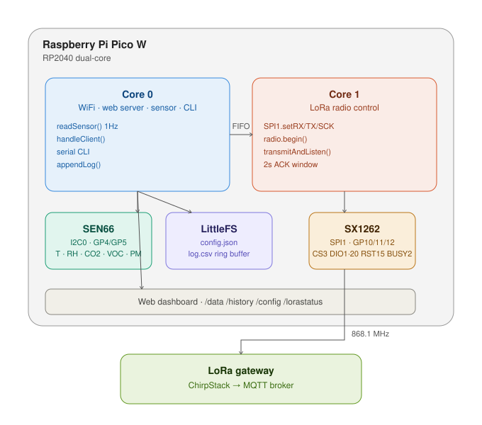
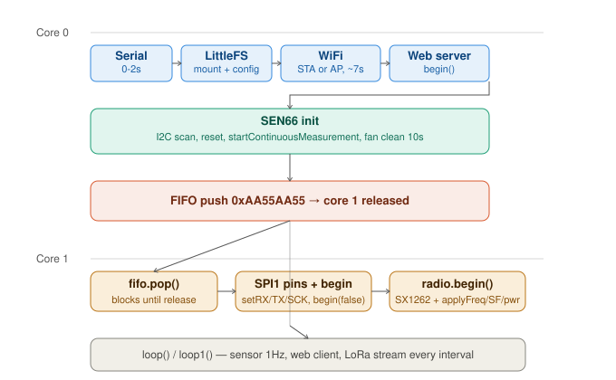

# SEN66 Environmental Monitor

A dual-core Raspberry Pi Pico W environmental sensor node, built for indoor
climate monitoring with an eventual path to beehive deployment. Reads
temperature, humidity, CO2, VOC, NOx and particulate matter from a Sensirion
SEN66, exposes a live web dashboard over WiFi, and transmits sensor data over
LoRa for long-range, low-power telemetry.





## Hardware

| Component | Interface | Pins |
|---|---|---|
| Raspberry Pi Pico W | — | RP2040, dual-core |
| Sensirion SEN66 | I2C0 | SDA=GP4, SCL=GP5, addr 0x6B (SEL→GND) |
| Waveshare Pico-LoRa-SX1262 | SPI1 | SCK=GP10, MOSI=GP11, MISO=GP12, CS=GP3, DIO1=GP20, RST=GP15, BUSY=GP2 |

SEN66 measures PM1.0/2.5/4.0/10, relative humidity, temperature, VOC index,
NOx index, and CO2 (SCD4x). CO2 needs roughly 30s from cold start to produce
a valid reading; fan cleaning (optional, ~11s) blows debris out of the PM
optical chamber and should be enabled for any unattended/production
deployment.

## Software stack

- **VSCode + PlatformIO**, `framework = arduino`, `board_build.core = earlephilhower`
- Platform: `https://github.com/maxgerhardt/platform-raspberrypi.git` (provides
  RP2040/Pico W support including LittleFS and `board = rpipicow`)
- Libraries: `Sensirion I2C SEN66`, `ArduinoJson`, `RadioLib`

## Architecture

The firmware runs genuinely dual-core. **Core 0** owns WiFi, the web server,
the SEN66 over I2C0, the LittleFS log/config, and the serial CLI. **Core 1**
owns the SX1262 over SPI1 exclusively — once `setup()` on core 0 completes
(including the SEN66 fan-clean delay), it pushes a release value through the
inter-core FIFO so `setup1()` on core 1 can safely initialise SPI1 and the
radio. This ordering matters: starting SPI1 from core 1 before core 0 has
finished its I2C work caused intermittent CRC errors on sensor reads during
development — see `context.md` for the debugging history.

```
src/
  main.cpp        setup()/loop() on core 0, setup1()/loop1() on core 1,
                   serial CLI, SX1262 Module object (owned here)
  sensor.cpp       SEN66 init/read, sentinel-value handling
  config.cpp       LittleFS config.json load/save
  datalog.cpp      CSV ring-buffer log, /history JSON builder
  wifi_mgr.cpp     STA-with-AP-fallback WiFi bring-up
  http_server.cpp  all web handlers + dashboard/config HTML
  lora_wan.cpp     plain LoRa TX/RX, ACK listen window, radio settings

include/           matching headers
data/config.json   default config — upload with `pio run --target uploadfs`
```

## Serial CLI

```
help                      command list
status                     full system + LoRa status
read                       single human-readable sensor reading
stream                     toggle CSV stream (Python-monitor compatible)
debug <n>                  0=off 1=web 2=sensor 4=lora (OR-able)

lora status                radio state, TX count, last ACK
lora send                  TX one sensor packet immediately
lora stream on|off         toggle automatic interval TX
lora test <freq> <msg>     one-shot TX on any frequency, any message
lora freq [mhz]            get/set frequency
lora sf <7-12>             set spreading factor
lora power <2-22>          set TX power, dBm
```

## Web interface

- `/` — live dashboard: sensor values, LoRa status with live TX countdown,
  tabbed history graphs (selectable channels and time range, axes labelled)
- `/config` — WiFi, logging, LoRa radio and node settings; saves to
  `config.json` and reboots
- `/log` — download the CSV log
- `/clearlog` — wipe the log
- `/data`, `/history`, `/lorastatus`, `/configjson` — JSON API backing the
  above

WiFi starts in STA mode if `wifi_ssid` is set in config, falling back to AP
mode (`SEN66-Monitor` / `sen66pass`, 192.168.4.1) otherwise. Open the
dashboard with `http://` explicitly — some browsers (Firefox) auto-upgrade
bare hostnames to HTTPS, which a local device cannot serve.

## LoRa

Two operating modes, set via `lora_mode` is implicit in which CLI/config path
you use — see `lora_wan.cpp`:

- **Plain LoRa** (current, working) — node-ID-prefixed JSON packets
  (`<SEN66-01>{"t":22.3,...}`), private sync word `0x12` so traffic doesn't
  collide with LoRaWAN gateways on the same frequency, 2-second ACK listen
  window after every TX, hardcoded 30s minimum interval as an EU868 duty
  cycle safety floor regardless of configured `lora_interval_s`.
- **LoRaWAN OTAA** (planned, not yet implemented in this codebase) — will
  join via OTAA and send Cayenne LPP payloads to a self-hosted ChirpStack
  gateway, which republishes decoded uplinks to MQTT for Node-RED/Grafana
  consumption.

Config fields: `lora_freq`, `lora_sf`, `lora_bw`, `lora_power`,
`lora_interval_s`, `lora_stream`, `node_id`. LoRaWAN credential fields
(`lora_dev_eui`, `lora_app_eui`, `lora_app_key`) are present in config but
unused until Phase B is built.

## Known limitations / next steps

- LoRaWAN OTAA join is not yet implemented in the current `lora_wan.cpp` —
  only plain peer-to-peer LoRa works today.
- PM optics can read saturated (`0xEB00` sentinel, shown as `SAT` in the UI)
  if the sensor is freshly unboxed, the inlet sticker is still attached, or
  airflow is otherwise obstructed — this is sensor behaviour, not a firmware
  bug.
- The 30s LoRa duty-cycle floor is a flat safety constant, not a proper
  airtime calculation from SF/BW/payload size. Adequate for EU868 at SF9 with
  these short payloads, but should be revisited before scaling to many
  nodes or larger payloads.
- See `context.md` for the full development/debugging history, including
  several false starts that are deliberately documented so they aren't
  repeated.