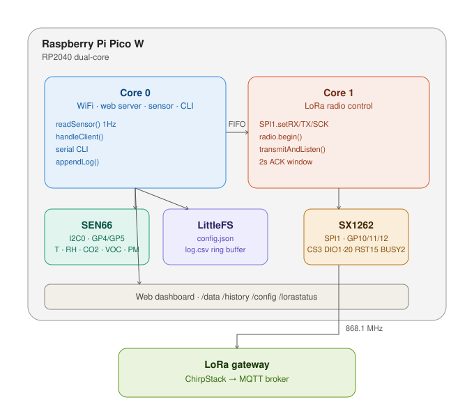
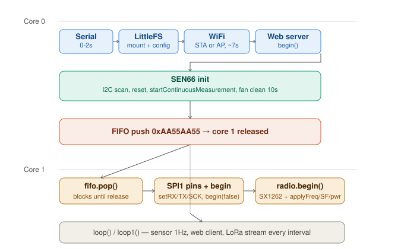

# SEN66 Environmental Monitor

A dual-core Raspberry Pi Pico W environmental sensor node, built for indoor
climate monitoring with an eventual path to beehive deployment. Reads
temperature, humidity, CO2, VOC, NOx and particulate matter from a Sensirion
SEN66, exposes a live web dashboard over WiFi, and transmits sensor data over
LoRa for long-range, low-power telemetry.





## Hardware

| Component | Interface | Pins |
|---|---|---|
| Raspberry Pi Pico W | — | RP2040, dual-core |
| Sensirion SEN66 | I2C0 | SDA=GP4, SCL=GP5, addr 0x6B (SEL→GND) |
| Waveshare Pico-LoRa-SX1262 | SPI1 | SCK=GP10, MOSI=GP11, MISO=GP12, CS=GP3, DIO1=GP20, RST=GP15, BUSY=GP2 |
| Waveshare Pico-LCD-1.14 | SPI1 (shared, see below) | SCK=GP10, MOSI=GP11, CS=GP9, DC=GP8, RST=GP12, BL=GP13 |

The LCD and LoRa shields are stacked on the same header and **share SPI1**
(SCK/MOSI) and, critically, **GP12** — the LCD's RST line and the SX1262's
MISO line are the same physical pin, both hardwired with no jumper option.
Only Button B (GP17) on the LCD's joystick/button cluster is free; every
other button/joystick pin (GP2, GP3, GP15, GP20) collides with an SX1262
signal. See "LCD display and SPI1 sharing" below for how this is resolved.

SEN66 measures PM1.0/2.5/4.0/10, relative humidity, temperature, VOC index,
NOx index, and CO2 (SCD4x). CO2 needs roughly 30s from cold start to produce
a valid reading; fan cleaning (optional, ~11s) blows debris out of the PM
optical chamber and should be enabled for any unattended/production
deployment.

## Software stack

- **VSCode + PlatformIO**, `framework = arduino`, `board_build.core = earlephilhower`
- Platform: `https://github.com/maxgerhardt/platform-raspberrypi.git` (provides
  RP2040/Pico W support including LittleFS and `board = rpipicow`)
- Libraries: `Sensirion I2C SEN66`, `ArduinoJson`, `RadioLib`
- LCD driver (`lcd_driver.h`, `lcd_buttons.h`) is a hand-rolled ST7789 tile-buffer
  driver, adapted from an earlier tonewheel-organ project, not a library dependency

## Architecture

The firmware runs genuinely dual-core. **Core 0** owns WiFi, the web server,
the SEN66 over I2C0, the LittleFS log/config, the serial CLI, and the LCD.
**Core 1** owns the SX1262 over SPI1 — once `setup()` on core 0 completes
(including the SEN66 fan-clean delay), it pushes a release value through the
inter-core FIFO so `setup1()` on core 1 can safely initialise SPI1 and the
radio. This ordering matters: starting SPI1 from core 1 before core 0 has
finished its I2C work caused intermittent CRC errors on sensor reads during
development — see `context.md` for that history, and for the much longer
saga of getting the LCD and radio to share SPI1 at all.

```
src/
  main.cpp        setup()/loop() on core 0, setup1()/loop1() on core 1,
                   serial CLI (incl. net/lora commands), SX1262 Module
                   object (owned here)
  sensor.cpp       SEN66 init/read, sentinel-value handling
  config.cpp       LittleFS config.json load/save
  datalog.cpp      CSV ring-buffer log, /history JSON builder
  wifi_mgr.cpp     STA-with-AP-fallback WiFi bring-up
  http_server.cpp  all web handlers + dashboard/config HTML
  lora_wan.cpp     plain LoRa TX/RX, ACK listen window, radio settings,
                   suspend/resume API for the LCD bus handoff
  lcd_display.cpp  ST7789 page rendering, button handling, SPI1
                   release/reclaim on screen off/on

include/           matching headers (lcd_driver.h, lcd_buttons.h are the
                   hand-rolled ST7789/button drivers, not third-party libs)
data/config.json   default config — upload with `pio run --target uploadfs`
```

## LCD display and SPI1 sharing

The LCD and the LoRa radio are both on SPI1, and — unlike a normal
multi-device SPI bus where each device just gets its own CS pin — the LCD's
RST line and the SX1262's MISO line are the **same physical pin (GP12)**,
hardwired with no way to separate them. RST needs to be a Pico-driven output
held high; MISO needs to be the SX1262's own output, which toggles as a
normal part of any SPI transaction. The two roles cannot coexist on one wire
at the same time.

The working solution is a **coarse-grained bus handoff**: the LCD and the
radio never use SPI1 concurrently, not even briefly. Only one of them owns
the bus at any moment, decided by whether the screen is on or off:

- **Screen off** (the default, low-power "LoRa node" state): the radio runs
  normally — `initLoRa()`/`loopLoRa()` on core 1, streaming or CLI-triggered
  TX as configured. The LCD's SPI1 pins (CS, DC, RST, SCK, MOSI) are all
  explicitly set to `INPUT`, so nothing is left driving GP12 except whatever
  the radio needs.
- **Button press wakes the screen**: `lcd_display.cpp` calls
  `lora_request_suspend()`, then polls `lora_is_suspended()` (up to a 3s
  timeout) before touching any pins. Core 1 sees the request at the top of
  its next `loopLoRa()` call, finishes whatever it's doing, puts the radio
  to sleep, releases SPI1, and sets `suspended = true`. Only then does the
  LCD run a **full** `lcd_init()` — not just a pin reconfiguration, the
  complete hardware-reset-pulse-plus-ST7789-init-sequence, since every pin
  was fully released as an input and there's no partial state to build on.
- **Screen times out (20s) or is cycled to OFF**: the LCD releases SPI1
  (`SPI1.end()` + all pins back to `INPUT`) and calls `lora_request_resume()`.
  Core 1 sees the flag clear and calls `initLoRa()` fresh — a complete
  re-init is simpler and more robust than trying to wake the radio from
  `sleep()` with partial state, and this only happens on the rare event of
  a screen transition, so the cost is negligible.

Button B (GP17, the only free pin — see the hardware table above) is
interrupt-driven rather than polled: a plain `digitalRead()` once per
`loop()` iteration was found to miss short taps whenever `loop()` was
briefly busy (a web request, a page render). The interrupt latches the
press the instant it happens, independent of `loop()` timing.

**LCD pages** (`LcdPage` enum in `lcd_display.h`): `SENSOR` → `WIFI` →
`LORA` → six per-channel graph pages → `OFF`, cycling forward on each
Button B press, wrapping back to `SENSOR` after `OFF`. The `LORA` page
shows `suspend` as its state whenever the radio is suspended for the LCD's
own use (which is always true while you're looking at any other page).

See `context.md` for the full, often painful, history of how this
architecture was arrived at — several plausible-looking fixes (mutex
tuning, per-transaction claim/release, forcing a hardware peripheral reset,
defensively deasserting the other device's CS) were tried and ruled out
before the actual fix (coarse-grained mutual exclusion, never concurrent
access) was found.

## Serial CLI

```
help                      command list
status                     full system + LoRa status
read                       single human-readable sensor reading
stream                     toggle CSV stream (Python-monitor compatible)
debug <n>                  0=off 1=web 2=sensor 4=lora 8=bus (OR-able)

net status                 WiFi mode, SSID, IP
net ssid <name>            set WiFi SSID, saved to flash immediately
net pass <password>        set WiFi password, saved to flash immediately
net reconnect              REBOOTS to apply saved SSID/password — see
                            "Network" below for why this must be a reboot

lora status                radio state, TX count, last ACK (shows
                            "suspend" while the LCD screen is on)
lora send                  TX one sensor packet immediately
lora stream on|off         toggle automatic interval TX
lora test <freq> <msg>     one-shot TX on any frequency, any message
lora freq [mhz]            get/set frequency
lora sf <7-12>              set spreading factor
lora power <2-22>          set TX power, dBm
```

`debug 8` (bus) enables diagnostic logging for the LCD/LoRa SPI1 handoff —
leave it off for normal use, turn it on only when debugging screen-on/off
transitions or radio suspend/resume timing.

## Web interface

- `/` — live dashboard: sensor values, LoRa status with live TX countdown,
  tabbed history graphs (selectable channels and time range, axes labelled)
- `/config` — WiFi, logging, LoRa radio and node settings; saves to
  `config.json` and reboots
- `/log` — download the CSV log
- `/clearlog` — wipe the log
- `/data`, `/history`, `/lorastatus`, `/configjson` — JSON API backing the
  above

WiFi starts in STA mode if `wifi_ssid` is set in config, falling back to AP
mode (`SEN66-Monitor` / `sen66pass`, 192.168.4.1) otherwise. Open the
dashboard with `http://` explicitly — some browsers (Firefox) auto-upgrade
bare hostnames to HTTPS, which a local device cannot serve.

## Network

Set or change WiFi credentials from the serial CLI:
```
net ssid myhomewifi
net pass mypassword
net reconnect
```
`net ssid`/`net pass` save to flash immediately but do **not** take effect
live. `net reconnect` genuinely reboots the device (`rp2040.reboot()`)
rather than trying to re-run WiFi setup in place — this is a deliberate
workaround for an arduino-pico core limitation, not a shortcut we took:
`WiFi.status()`/`WiFi.localIP()` both key off an internal `_apMode` flag
that isn't reliably cleared by switching `WiFi.mode()` at runtime once AP
mode has been used, so a live re-init after an AP fallback can report a
fake instant "connected" using the AP's own IP address instead of a real
DHCP lease from your router (see `context.md` and
[earlephilhower/arduino-pico#762](https://github.com/earlephilhower/arduino-pico/issues/762)).
A full reboot is the only reliable way to get a clean STA connection after
the device has ever been in AP mode during the current power cycle.

## LoRa

Two operating modes, set via `lora_mode` is implicit in which CLI/config path
you use — see `lora_wan.cpp`:

- **Plain LoRa** (current, working) — node-ID-prefixed JSON packets
  (`<SEN66-01>{"t":22.3,...}`), private sync word `0x12` so traffic doesn't
  collide with LoRaWAN gateways on the same frequency, 2-second ACK listen
  window after every TX, hardcoded 30s minimum interval as an EU868 duty
  cycle safety floor regardless of configured `lora_interval_s`.
- **LoRaWAN OTAA** (planned, not yet implemented in this codebase) — will
  join via OTAA and send Cayenne LPP payloads to a self-hosted ChirpStack
  gateway, which republishes decoded uplinks to MQTT for Node-RED/Grafana
  consumption.

Config fields: `lora_freq`, `lora_sf`, `lora_bw`, `lora_power`,
`lora_interval_s`, `lora_stream`, `node_id`. LoRaWAN credential fields
(`lora_dev_eui`, `lora_app_eui`, `lora_app_key`) are present in config but
unused until Phase B is built.

## Known limitations / next steps

- LoRaWAN OTAA join is not yet implemented in the current `lora_wan.cpp` —
  only plain peer-to-peer LoRa works today.
- PM optics can read saturated (`0xEB00` sentinel, shown as `SAT` in the UI)
  if the sensor is freshly unboxed, the inlet sticker is still attached, or
  airflow is otherwise obstructed — this is sensor behaviour, not a firmware
  bug.
- The 30s LoRa duty-cycle floor is a flat safety constant, not a proper
  airtime calculation from SF/BW/payload size. Adequate for EU868 at SF9 with
  these short payloads, but should be revisited before scaling to many
  nodes or larger payloads.
- `net reconnect` (and any future WiFi credential change) requires a reboot
  to take effect, by design — see "Network" above. There is currently no
  way to switch STA→AP→STA within one power cycle and get a genuine DHCP
  lease; don't try to "fix" this with a live `startWiFi()` re-init, it's
  been tried and doesn't work on this platform.
- The LCD cannot show live data and the radio cannot transmit at the same
  instant — this is intentional (see "LCD display and SPI1 sharing"), not
  a bug to fix. If simultaneous LCD+radio operation is ever needed, it
  would require moving one of them off SPI1 entirely (e.g. a different LCD
  interface) rather than trying to time-slice the shared bus more finely
  than we already tried and failed to do.
- See `context.md` for the full development/debugging history, including
  several substantial false starts that are deliberately documented so
  they aren't repeated.